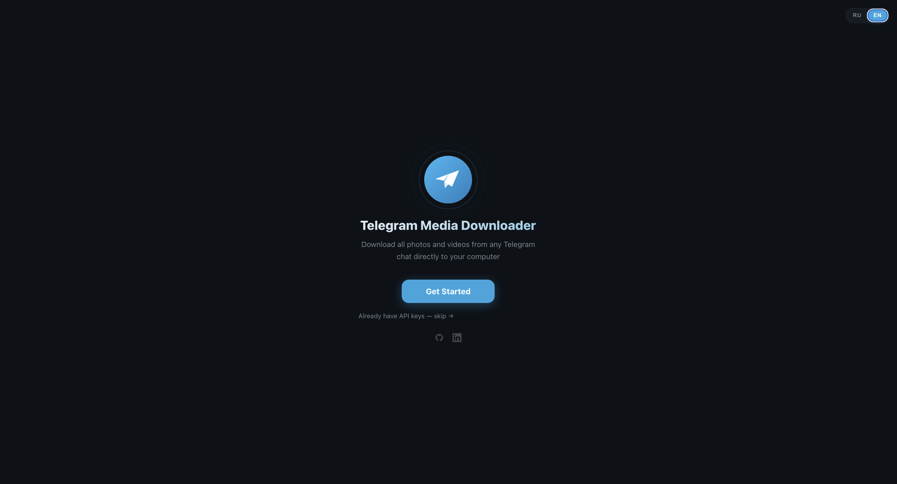
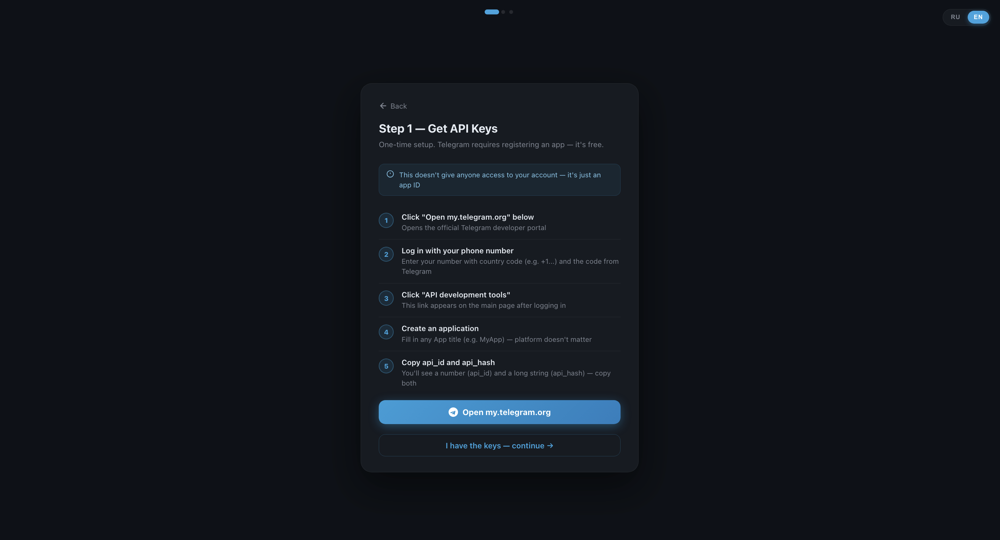
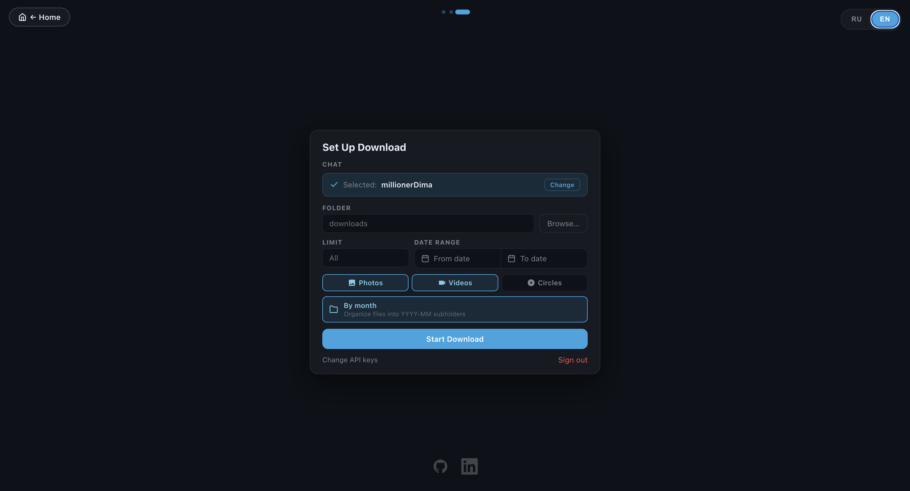
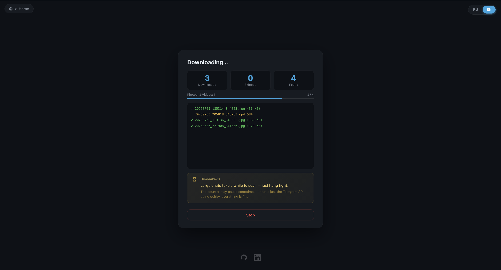

# GramSave — Telegram Media Downloader

Ever wanted to save all the photos and videos from a Telegram chat without clicking on each one manually? That's exactly what GramSave does. Pick a chat, hit Download, and it handles the rest — right from your browser.

No cloud. No account. Everything stays on your machine.



---

## Super easy to run

Just double-click `start.sh` or run one line in the terminal:

```bash
bash start.sh
```

That's it. It checks your Python version, installs everything it needs, and opens the server. Then go to **http://localhost:5055** in your browser and you're in.

---

## Getting your API keys

On first launch the app walks you through getting API keys from Telegram — it takes about 2 minutes and it's completely free.



The short version:
1. Go to **https://my.telegram.org** and sign in with your phone number
2. Click **API development tools**
3. Create an app (any name works)
4. Copy **App api_id** and **App api_hash** — paste them into GramSave

You only do this once. The session is saved so you won't need to log in again.

---

## Set up your download

Search for any chat from your account, pick what you want — photos, videos, round videos — set a date range if needed, and go.



| | |
|---|---|
| Photos | ✅ |
| Videos | ✅ |
| Round videos | ✅ toggle on/off |
| GIFs | ❌ skipped |
| Date range filter | ✅ |
| Skip already downloaded | ✅ safe to re-run |
| Parallel downloads | ✅ 3 at a time |

---

## Watch it work

You can see exactly what's happening — which files are being scanned, what's downloading, and how far along it is.



---

## Requirements

- Python 3.10 or newer
- A Telegram account
- macOS (the folder picker uses a native dialog; works on Windows/Linux too, just without it)

---

## Project structure

```
app.py                 — backend (Flask + Telethon)
templates/index.html   — the whole UI in one file
requirements.txt       — dependencies
start.sh               — one-command launcher
docs/                  — screenshots
.credentials.json      — your API keys (auto-created, never committed)
session.session        — Telegram session (auto-created, never committed)
```

---

## License

MIT — use it however you like.
